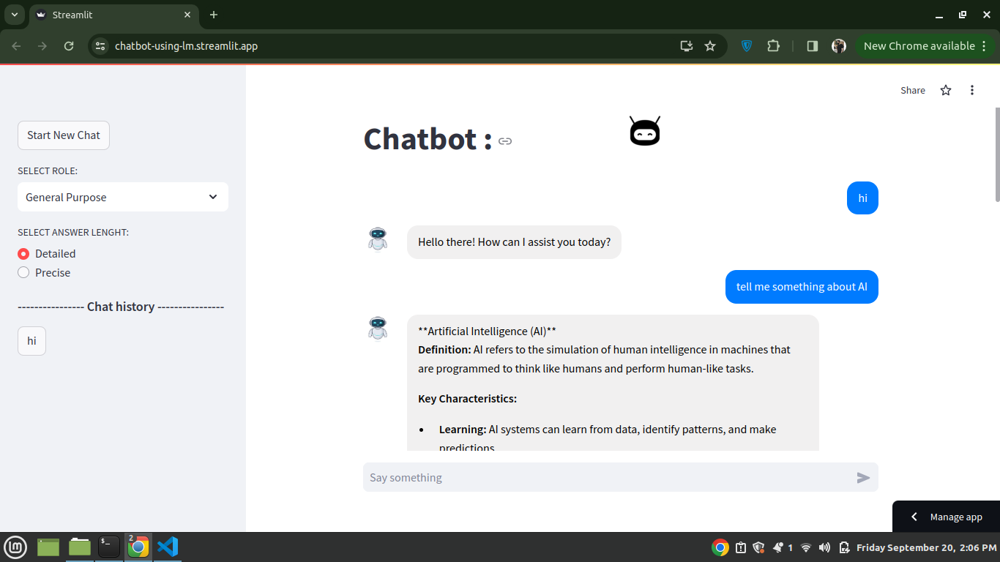

# Chatbot-Using-LLM
 
---MAKE SURE TO USE YOUR API KEY IN CONFIG FILE BEFORE USING IT--

🚀 Excited to Share My AI-Chatbot-Using-Langchain Project 🚀

I've been working on a powerful chatbot application using Langchain, Google's Generative AI, and Streamlit, and I'm thrilled with how it's turned out! This project focuses on building an interactive, multi-chat session interface with role-based AI responses across different sectors like Healthcare, Finance, and Education.

💡 Key Features:

Multi-session chat management
Role-based responses (customized for general, healthcare, finance, and education queries)
Dynamic chat titling based on conversation content
Clean and intuitive UI with a conversational design

🤖 This was an amazing opportunity to dive deeper into building scalable, user-friendly AI applications. I'm excited to see how this can transform personalized AI interactions!

👉 I'd love for you to try it out and share your feedback with me! Your insights will be invaluable in improving and refining this tool.

🔗 Check it out here:
Live App: https://lnkd.in/dFYFqwtX
Looking forward to hearing your thoughts!
